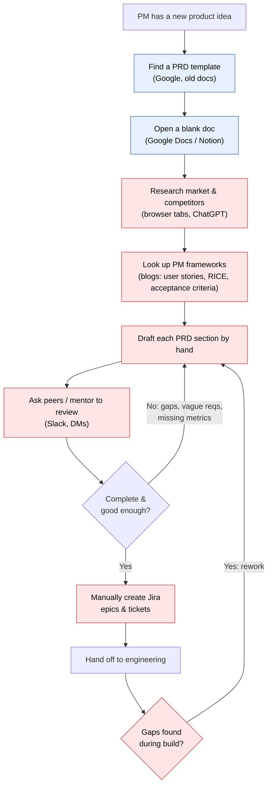
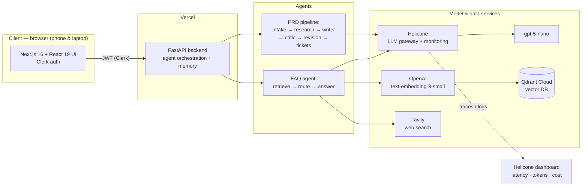
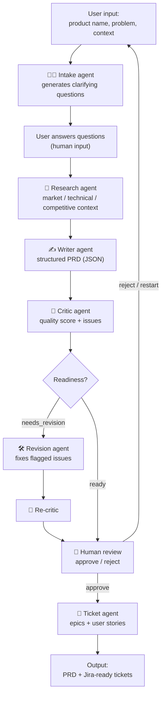
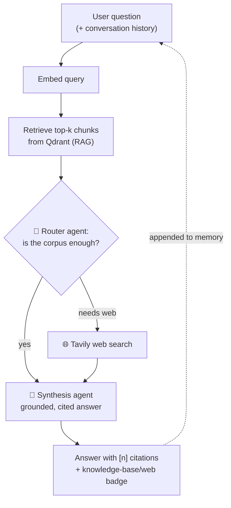

# PRD Generator — Tasks 1 & 2: Problem, Audience & Solution

> Certification challenge write-up covering Task 1 (Defining Problem, Audience, and Scope)
> and Task 2 (Propose a Solution) for **PRD Generator**, an agentic PRD generator with a
> RAG-powered product-management FAQ assistant.

---

## Task 1 — Defining the Problem, Audience, and Scope

### 1.1 Problem (one sentence)

**Turning a rough product idea into a clear, complete, and consistent requirements document is slow, manual, and error-prone for product managers working on a new product.**

*(No solution is stated or implied — only the problem.)*

### 1.2 Why this is a problem for this user

**Who has the problem.** Product managers — and founders acting as their own PM — who are working on a **new (0→1) product** and lack an established PRD template, a review process, or a senior PM to check their work. This is felt most acutely by early-career PMs and PMs at early-stage startups: they face maximum ambiguity (nothing is written down yet) at the same time as a process and experience gap (no template library, no PMO, no reviewer). They are also the people most likely to reach for an on-demand source of product-management best practices while they work.

**What they are trying to do.** Produce an engineering-ready Product Requirements Document that aligns engineering, design, and stakeholders on *what* to build and *why* — a document with a crisp problem statement, target users, functional and non-functional requirements, user flows, success metrics, risks, and non-goals — and then translate it into tickets the team can pick up. Along the way they need to make good product decisions: how to write user stories and acceptance criteria, how to prioritize, and how to define measurable success.

**How they handle it today.** They start from a blank document or a borrowed template, manually research the market and competitors across many browser tabs and general-purpose LLM chats, google product-management frameworks and blog posts, draft each section by hand, ping peers or a mentor on Slack for review, revise, and finally hand-create Jira tickets before handing off to engineering.

**Why that isn't good enough.** The process takes hours to days per PRD; quality is inconsistent and depends entirely on the individual PM's experience; drafts routinely miss the high-leverage but easy-to-forget parts — non-goals, edge cases, and measurable success metrics — which are among the most common PRD failures; there is no built-in quality gate, so gaps surface late during engineering when they are expensive to fix; and constant tool-switching between docs, browser, LLM chat, Slack, and Jira is slow and fragmenting. Less-experienced PMs additionally lack a trusted, on-demand source of best-practice guidance grounded in real product-management references.

### 1.3 Current-state workflow (how the user solves this today)

**Where the workflow is slow, repetitive, or error-prone (highlighted in red):**

- **Research (D)** — manual, scattered across browser tabs and ad-hoc LLM chats; nothing is reusable.
- **Framework lookup (E)** — repeatedly re-googling the same best practices (how to write acceptance criteria, which prioritization framework to use).
- **Manual drafting (F)** — the slowest step; structure and completeness depend entirely on the PM's memory and experience.
- **Peer review (G)** — asynchronous, blocking, and inconsistent; a mentor may not be available.
- **Manual ticket creation (I)** — tedious re-typing of the PRD into Jira epics and stories.
- **Rework loop (K)** — missing edge cases, non-goals, or metrics are discovered *during* engineering, forcing expensive back-and-forth.

### 1.4 Evaluation questions and input–output pairs

These are the questions a target user is likely to ask, used to evaluate the application. They double as the seed set for the Task 5 evaluation harness. **FAQ / RAG** items check retrieval + grounded answering; **PRD generation** items check the multi-agent pipeline output.

#### A. FAQ assistant (RAG) — question → expected answer characteristics

| # | User question | Expected answer should include | Expected source |
|---|---------------|-------------------------------|-----------------|
| 1 | What sections should a PRD contain? | Overview/objectives, problem statement, target users, goals & non-goals, functional & non-functional requirements, user flows, success metrics, risks, open questions | Knowledge base (PRD structure) |
| 2 | How do I write good acceptance criteria? | Given/When/Then format; testable & unambiguous; cover unhappy paths/edge cases; 2–5 per story | Knowledge base (acceptance criteria) |
| 3 | When should I use RICE vs. MoSCoW? | RICE = data-driven numeric ranking (Reach·Impact·Confidence/Effort); MoSCoW = fast scope buckets; trade-offs | Knowledge base (prioritization) |
| 4 | What's the difference between leading and lagging indicators? | Leading = early/predictive (activation, time-to-value); lagging = outcome (retention, revenue); track both | Knowledge base (metrics & OKRs) |
| 5 | Why should a PRD include non-goals? | Explicitly out-of-scope items; prevent scope creep; set stakeholder expectations | Knowledge base (structure / common mistakes) |
| 6 | What are the most common PRD mistakes? | Solutionizing too early, vague/untestable requirements, missing non-goals, no success metrics, ignoring edge cases | Knowledge base (common mistakes) |
| 7 | What is Jobs To Be Done? | Framing needs as the "job" a user hires the product for; focus on outcome/circumstance, not demographics | Knowledge base (discovery) |
| 8 | What are the newest AI/PM features in Jira or Notion in 2025? | Router should trigger **web search**; answer cites live web sources; grounded, no fabrication | Tavily (web) |
| 9 | What's the weather today? | Out of scope; the assistant should decline / state it can't help from its sources | Neither (graceful refusal) |
| 10 | (Follow-up) "Give me an example of #2 for a login feature." | Uses **conversation memory**; produces a Given/When/Then example grounded in prior turn | Memory + knowledge base |

**Pass criteria:** answer is grounded in retrieved context, cites the correct source(s), triggers web search only when the corpus is insufficient (Q8), and refuses gracefully when nothing relevant is retrieved (Q9).

#### B. PRD generation (multi-agent pipeline) — input → expected output

| # | Input (product idea) | Expected output properties |
|---|----------------------|----------------------------|
| 1 | Name: "Interview Prep"; Problem: "SWE candidates struggle to practice realistic interviews"; Context: "solo devs, mobile" | Complete PRD: problem statement, ≥2 target-user segments, ≥5 functional requirements each with acceptance criteria, ≥3 non-functional requirements, ≥2 user flows with error cases, ≥3 measurable success metrics, risks with mitigations; a quality score ≥70; Jira epics & stories generated |
| 2 | Sparse input: Name + one-line problem, no context | Intake agent asks 3–5 clarifying questions targeting the missing context before generating |
| 3 | Vague/ambiguous problem statement | Critic flags completeness/clarity issues; revision agent improves the PRD; final readiness is "ready" or issues are surfaced |

---

## Task 2 — Proposed Solution

### 2.1 Solution (one sentence)

**PRD Generator is a browser-based, multi-agent application that turns a product idea into a structured, quality-checked, engineering-ready PRD and Jira-ready tickets, backed by a RAG-powered assistant that answers product-management questions grounded in a best-practice knowledge base and live web search.**

### 2.2 Infrastructure diagram

**Why each component (one sentence each):**

- **LLM — `gpt-5-nano` (OpenAI):** generates the clarifying questions, research synthesis, the structured PRD, the critique, the revision, the tickets, and the FAQ answers; chosen for low cost and adjustable reasoning effort that keeps latency manageable.
- **Agent orchestration — custom Python orchestration inside FastAPI:** sequences the agents and runs the router decision explicitly in code, chosen for transparency and full control without the overhead or lock-in of a heavier framework.
- **Tools — Tavily (web search) + Qdrant retriever (knowledge-base search):** give the FAQ agent access to both current public information and the private best-practice corpus, so it can ground answers in the right source.
- **Embedding model — OpenAI `text-embedding-3-small` (1536-d):** converts corpus chunks and user queries into vectors for semantic retrieval, chosen for a strong quality-to-cost ratio.
- **Vector database — Qdrant Cloud:** stores and similarity-searches the PM knowledge-base embeddings, chosen for a managed free tier that works cleanly with serverless deployment.
- **Monitoring — Helicone + a custom per-step tracker:** Helicone logs every model call (latency, tokens, cost) while the in-app tracker attaches the same per-step metrics to each API response, giving end-to-end observability.
- **Evaluation framework — RAGAS / LLM-as-judge (Task 5):** measures retrieval relevance and answer faithfulness/quality against the test set, chosen because it targets RAG-specific failure modes.
- **User interface — Next.js 16 + React 19 with Clerk auth:** a responsive web app that runs in the browser on both phone and laptop, satisfying the "run it anywhere" requirement.
- **Deployment — Vercel:** hosts the Next.js frontend and the FastAPI backend (as a serverless function) together behind one public URL.
- **LLM gateway — Helicone:** routes every model call through a single point for logging, caching, and provider flexibility, satisfying the gateway requirement (and doubling as the monitoring tool).
- **Memory — FAQ conversation history + PRD history:** the FAQ agent threads recent turns into each answer for multi-turn follow-ups, and completed PRDs are saved to browser history for reuse.
- **Authentication — Clerk:** handles sign-in/sign-up and issues the JWT that secures every backend call.

### 2.3 Agent workflow diagrams

The application has two agentic workflows. The **PRD pipeline** shows multi-agent orchestration with a decision point and a human approval step; the **FAQ agent** shows the agentic RAG loop with retrieval, a routing decision, and a tool call.

**Workflow A — PRD generation pipeline**

**Workflow B — FAQ agent (Agentic RAG)**

**How the application solves the user's problem.** For PRD generation, the user submits a product name, problem statement, and any context. The **intake agent** first reasons about what is missing and asks 3–5 targeted clarifying questions — the first decision point, which prevents the system from writing a PRD on top of ambiguity. After the user answers, the **research agent** synthesizes market, technical, and competitive context, which the **writer agent** turns into a fully structured PRD. The **critic agent** then scores the draft and lists concrete issues; if it judges the PRD *needs revision*, the **revision agent** fixes the flagged problems and the critic re-evaluates — a self-correcting quality loop that a lone PM doing this by hand does not have. The result is presented to the user for **human review and approval**, and only on approval does the **ticket agent** break the PRD into Jira-ready epics and stories. Every step is traced (latency, tokens, cost) through the Helicone gateway.

For the FAQ assistant, the user's question (plus recent conversation as memory) is embedded and used to **retrieve** the most relevant chunks from the Qdrant knowledge base of product-management best practices (RAG). A **router agent** then decides whether that retrieved context is sufficient or whether the question needs current, public information — the agent's key reasoning step. If the corpus is enough (e.g., "how do I write acceptance criteria?"), it answers directly; if not (e.g., "what's new in Jira in 2025?"), it calls the **Tavily** web-search tool and folds those results in. The **synthesis agent** writes an answer grounded strictly in the assembled context, with inline `[n]` citations mapping to the exact knowledge-base or web sources, and refuses to fabricate when the sources don't support an answer. This directly attacks the user's current-state pain points: it replaces scattered manual research and re-googling of frameworks with a single, cited, on-demand assistant, and it replaces slow, inconsistent, hand-built PRDs with a structured, quality-checked, engineering-ready document.

---

*Requirements satisfied: LLM gateway (Helicone), memory component (FAQ conversation history + PRD history), and browser access on phone and laptop (Next.js on Vercel).*
